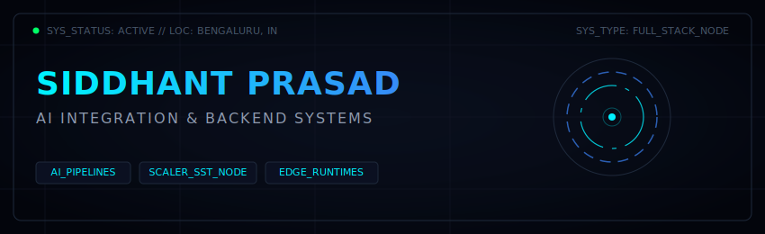
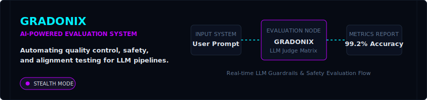
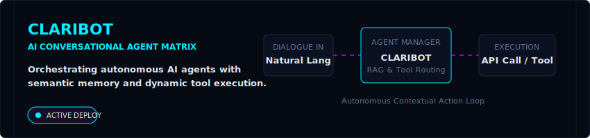
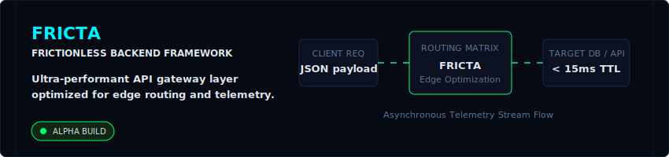

  <!-- Hero Cinematic Banner -->
  
  
   

  <!-- Animated Typing Terminal Subtitle -->
  

   

  <!-- Quick Connection Badges -->
  
  
  
  

 

---

## ⚡ EXECUTIVE SUMMARY

I am a **Full Stack Developer** specializing in AI-integrated applications, high-throughput backend architectures, and scalable startup engineering. My design philosophy balances deterministic systems engineering with adaptive artificial intelligence to build memorable, production-level products.

- 📍 **Operational Base:** Bengaluru, India
- 🎓 **Institutional Training:** Scaler School of Technology
- 🚀 **Current Focus:** AI-integrated system design, Edge runtimes, and Orchestrating Multi-Agent Networks.

 

---

## 🛠️ TECH ARSENAL

<table align="center" width="100%">
  <tr>
    <td align="center" width="25%" valign="top">
      <b><nobr>💻 LANGUAGES</nobr></b>
        
       
       
       
      
    </td>
    <td align="center" width="25%" valign="top">
      <b><nobr>⚡ FRAMEWORKS</nobr></b>
        
       
       
       
      
    </td>
    <td align="center" width="25%" valign="top">
      <b><nobr>💾 DATABASES</nobr></b>
        
       
      
    </td>
    <td align="center" width="25%" valign="top">
      <b><nobr>🛠️ INFRA &amp; TOOLS</nobr></b>
        
       
       
       
      
    </td>
  </tr>
</table>

 

---

## 🚀 ACTIVE SHIPS (STARTUPS & PROJECTS)

### 🛡️ **Gradonix** — LLM Quality & Alignment Infrastructure
An evaluation platform designed to run automated safety, quality, and alignment checks across prompt pipelines, protecting LLMs from jailbreaks and hallucination drifts.

  

---

### 🧠 **Claribot** — Autonomous Conversational Matrix
An agent management layer orchestrating autonomous reasoning loops. Claribot processes unstructured dialogue inputs and dynamically maps them to internal tool APIs using high-precision vector search.

  

---

### ⚡ **Fricta** — Frictionless Developer Gateway
An edge-oriented proxy and logging system serving as an ultra-fast routing middleware for AI platforms, executing microservice integrations with sub-15ms overheads.

  

 

---

## 🔗 TERMINAL CONNECTIONS

| Network Interface | Host Address / Endpoint | Status |
| :--- | :--- | :--- |
| 🌐 **Main Node (Portfolio)** | [siddhant-prasad.vercel.app](https://siddhant-prasad.vercel.app/) | `ONLINE` |
| 💼 **Professional Network** | [linkedin.com/in/siddhant-prasad-50516a339](https://www.linkedin.com/in/siddhant-prasad-50516a339) | `ACTIVE` |
| 🐦 **Transmission Node (X)** | [x.com/prasad_sid61519](https://x.com/prasad_sid61519) | `ACTIVE` |
| 📸 **Visual Feed (Instagram)** | [instagram.com/siddlovescoding](https://instagram.com/siddlovescoding) | `STANDBY` |
| 📧 **Direct Protocol (Email)** | `siddhant.24bcs10255@sst.scaler.com` | `SECURE` |

 

---

> **`[CONSOLE_LOG]`** *“The best way to predict the future is to write the compiler for it. We aren't here to build wrappers; we are here to build infrastructure that endures.”*

 

  
    
  ⚡ SYSTEM METRICS: FULLY OPERATIONAL // SECURE CONSOLE ACCESS GRANTED 

